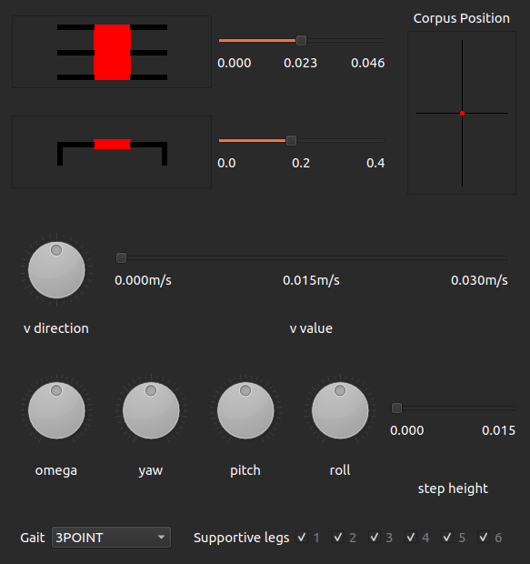
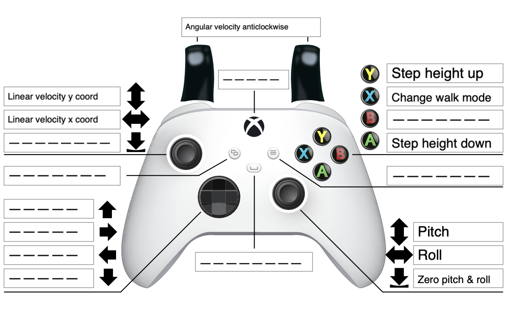

# Elkapod teleoperation repository

[](https://opensource.org/licenses/MIT)


## Installation
1. Create a workspace and clone packages into it
```bash
mkdir -p elkapod_teleop/src/
git clone https://github.com/HexapodBionik/elkapod_teleop.git elkapod_teleop/src/
```
2. Move into `elkapod_teleop/` folder and download all additional packages using [vcstool](http://wiki.ros.org/vcstool)
```bash
cd elkapod_teleop/
vcs import src/ < src/repos.yaml
```
3. Install PySide6 and required packages for GUI
```bash
pip install PySide6
sudo apt install libxcb-xinerama0 libxcb-cursor0 libxcb-keysyms1 libxcb-icccm4 libxcb-image0 libxcb-render-util0 libxcb-shape0 libxcb-xfixes0
```

## Usage
Build the workspace and setup the environment.
```bash
colcon build
source install/setup.bash
```
Depending on preference choose the way of controling - [GUI](#elkapod-control-using-gui) or [joystick controller](#elkapod-control-using-joystick-controller) and follow instructions below.


## Elkapod Control using GUI
Run the ROS2 node:
```bash
ros2 run elkapod_controller_gui elkapod_controller_gui
```
**Elkapod Control Panel Layout**  


- First slider controls the width of the leg spacing
- Second slider controls the height of the corpus
- `Corpus Position` controls 
- `v direction` - the direction of move, relative to Elkapod head
- `v value` - linear velocity of moving
- `omega` - angular velocity of moving
- `yaw` - roll
- `pitch` - pitch
- `roll` - yaw
- `step height` - lift height of leg. If set to 0, Elkapod will crawl without lifting legs
- `gait` - chooses the type of movement. Supported types:
    - 3POINT - 3 legs moving and 3 transferring corpus at time
    - RIPPLE - 
    - MECHATRONICS - one leg moving at time
    - STAND - legs in the base position
- `supportive legs` - choose legs to lift and turn them off

## Elkapod Control using joystick controller
> [!IMPORTANT] 
>
> Currently only Xbox controllers are supported
>

Launch the ROS2 nodes:
```bash
ros2 launch elkapod_teleop_joy elkapod_joy_controller.launch.py
```

**Current key & axes binding**  


### Credits
Xbox® and Xbox Series X® Controller are registered trademarks of Microsoft Corporation.

Binding template created by Goldwolf & Shoadow.