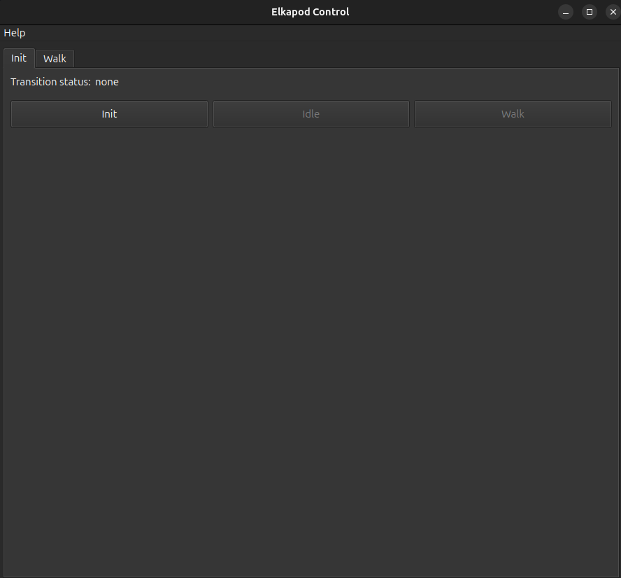
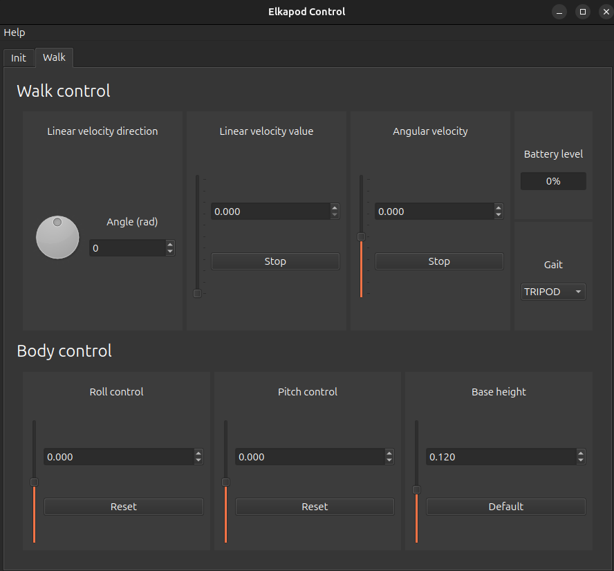
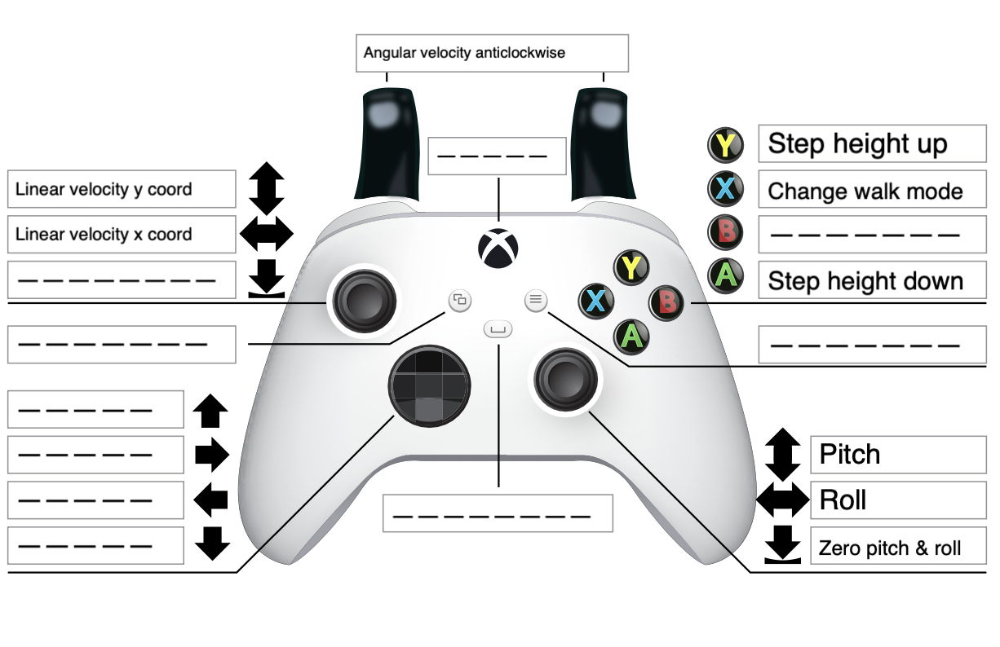

# Elkapod teleoperation repository

[](https://opensource.org/licenses/MIT)


## Installation
1. Create a workspace and clone packages into it
```bash
mkdir -p elkapod_teleop/src/
git clone https://github.com/HexapodBionik/elkapod_teleop.git elkapod_teleop/src/
```
2. Move into `elkapod_teleop/` folder and download all additional packages using [vcstool](http://wiki.ros.org/vcstool)
```bash
cd elkapod_teleop/
vcs import src/ < src/repos.yaml
```
3. Install PySide6 and required packages for GUI
```bash
pip install PySide6
sudo apt install libxcb-xinerama0 libxcb-cursor0 libxcb-keysyms1 libxcb-icccm4 libxcb-image0 libxcb-render-util0 libxcb-shape0 libxcb-xfixes0
```

## Usage
Build the workspace and setup the environment.
```bash
colcon build
source install/setup.bash
```
Depending on preference choose the way of controling - [GUI](#elkapod-control-using-gui) or [joystick controller](#elkapod-control-using-joystick-controller) and follow instructions below.


## Elkapod Control using GUI
Run the ROS2 node:
```bash
ros2 run elkapod_controller_gui elkapod_controller_gui
```
**Elkapod Control Panel Layout**  


1. **Init** window controls transition between robot states. After startup robot has to be initialized with **Init** button.
2. In next step robot has to stand up and for this task you should use **Idle** button. 
3. Finally in order to activate the controller use **Walk button**. 




## Elkapod Control using gamepad
### Supported gamepad models
- `Xbox Series X gamepad` (default)
- `Logitech F710`

### Launch
1. Xbox Series X
```bash
ros2 launch elkapod_teleop_joy elkapod_joy_controller.launch.py gamepad_model:='xbox-series-x'
```
2. Logitech F710
```bash
ros2 launch elkapod_teleop_joy elkapod_joy_controller.launch.py gamepad_model:='logitech-f710'
```

### Current key & axes binding


### Credits
Binding template created by Goldwolf & Shoadow.
